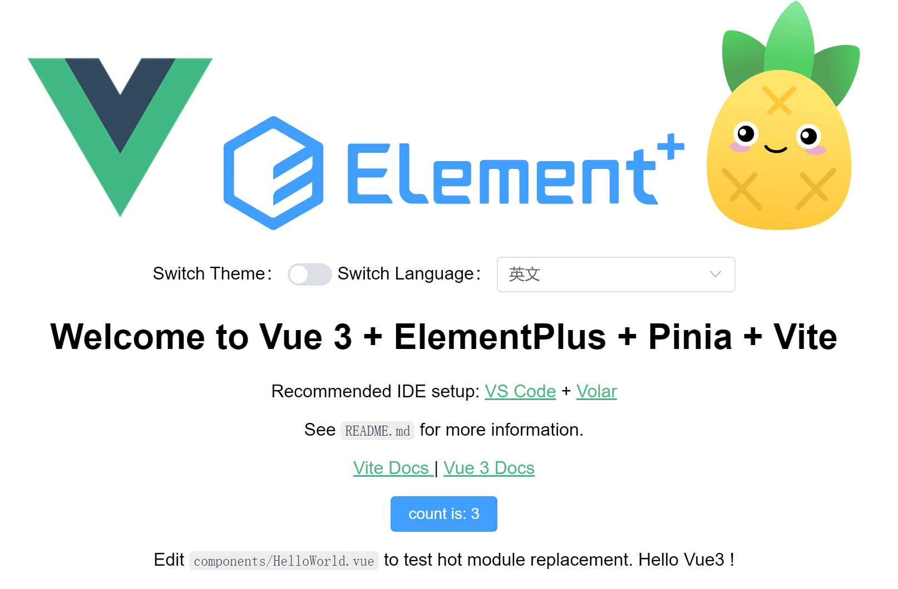

# Vue3 + TypeScript + Vite + Pinia + ElementPlus

> 开箱即用的vue3 web脚手架



- [x] Vue3
- [x] Vite
- [x] TypeScript
- [x] Pinia
- [x] VueRouter
- [x] ElementPlus
- [x] I18n
- [x] Theme

## Project setup

```bash
npm install or yarn or pnpm install
```

### Compiles and hot-reloads for development

```bash
npm run dev or yarn dev or pnpm run dev
```

### Compiles and minifies for test 

```
npm run build:test or yarn build:test or pnpm run build:test
```

### Compiles and minifies for production

```bash
npm run build or yarn build or pnpm run build
```

## Usage

```bash
git clone https://github.com/tiger6/vue3-vite-pinia-web.git
cd vue3-vite-pinia-web
npm i
npm run dev
```

### Custom theme

See `src/assets/styles/element/index.scss`.

